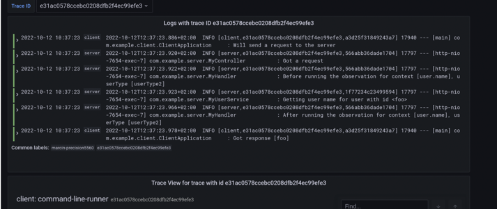

# spring-boot-observability
Spring Boot project example to see OpenTelemetry integration works under the hood. Grafana Tempo for metrics storage, Grafana Loki for logging backend, Grafana to see the visualizations of those metrics

>gradle build

Run loki,tempo,grafana,prometheus
>docker-compose up
    To access Prometheus go to http://localhost:9090/
    
    To access Grafana go to http://localhost:3000/

    

A simple terminal UI for both docker and docker-compose:
    lazydocker
    https://github.com/jesseduffield/lazydocker
    brew install lazydocker
    
> layzdocker

Run the server and client side application
    exreq: http://localhost:7654/user/1